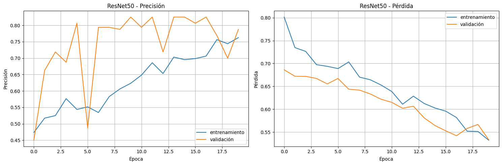

# DIAGNOSTICO DE NEUMONIA MEDIANTE DEEP LEARNING

## Índice

- [Índice](#índice)
- [Introducción](#introducción)
  - [Métodos Utilizados](#métodos-utilizados)
  - [Tecnologías](#tecnologías)
- [Descarga y Configuración](#descarga-y-configuración)
  - [Requisitos Previos](#requisitos-previos)
  - [Cómo Ejecutar](#cómo-ejecutar)
- [Declaración del Problema](#declaración-del-problema)
  - [Objetivos](#objetivos)
  - [Preparación de Datos:](#preparación-de-datos)
  - [Construcción y Evaluación del Modelo](#construcción-y-evaluación-del-modelo)
  - [Conclusiones](#conclusiones)


## Introducción

Maestria en Ciencia de Datos 5v
**Machine Learning**

### **Integrates de Grupo:**
  
  ### Grupo D
  ### Dimensionality Reduction

  * Javier Alejandro Velasco Villarroel
  * Juan Fernando Mamani Huayhua
  * Estanislao Guido Paco Ramos

-------------------

  La neumonía sigue siendo una de las principales causas de mortalidad a nivel mundial, especialmente en países en desarrollo. El diagnóstico temprano y preciso es crucial para el tratamiento efectivo. Este proyecto desarrolla un sistema automatizado de detección de neumonía utilizando técnicas avanzadas de Deep Learning sobre imágenes de rayos X torácicos, implementando y comparando tres arquitecturas diferentes: CNN personalizada, VGG16 y ResNet50.

## Métodos Utilizados

### Preprocesamiento de Datos

Normalización de Imágenes:

* Redimensionamiento a 224x224 píxeles
* Conversión a formato RGB

### Arquitectura de Modelos

Modelo CNN Personalizado

```
Arquitectura:
- Conv2D(32, (3,3)) + ReLU
- MaxPooling2D(2,2)
- Conv2D(64, (3,3)) + ReLU
- MaxPooling2D(2,2)
- Conv2D(64, (3,3)) + ReLU
- MaxPooling2D(2,2)
- Conv2D(128, (3,3)) + ReLU
- Dense(128) + ReLU
- Dropout(0.5)
- Dense(1) + Sigmoid
```

Modelo VGG16 Transfer Learning

```
Arquitectura:
- Base VGG16 (preentrenada ImageNet)
- Flatten
- Dense(512) + ReLU
- Dropout(0.5)
- Dense(256) + ReLU
- Dropout(0.3)
- Dense(1) + Sigmoid
```

ResNet50

```
ResNet50 Architecture:
- Base ResNet50 (preentrenado)
- GlobalAveragePooling2D
- Dense(512) + ReLU
- Dropout(0.5)
- Dense(256) + ReLU
- Dense(1, sigmoid)
```

### Métricas de Evaluación

Métricas de Evaluación Principal:

    - Accuracy (Precisión)
    - Precision (Exactitud)
    - Recall (Sensibilidad)
    - F1-Score
    - Matriz de Confusión

### Técnicas de Análisis

- Análisis de Rendimiento
- Análisis de Errores
- Métricas de Eficiencia Computacional

### Comparación de Modelos

- Métricas Comparativas
- Análisis Estadístico

Modelo AccuracyPrecision Recall F1-Score Tiempo Inferencia(ms)

### Validación y Pruebas

- Validación Cruzada
- Test de Robustez

### Visualización de Resultados

- Gráficos de Rendimiento

## Tecnologías

Lenguaje de Programación

    Python 3.8+: Lenguaje principal para desarrollo del sistema

    Ventajas: Amplia biblioteca de ML/DL, facilidad de uso, gran comunidad
    Aplicación: Implementación de modelos, procesamiento de datos, análisis


Frameworks de Deep Learning

    TensorFlow 2.x

    Framework principal para implementación de redes neuronales
    Usado para: CNN, VGG16, ResNet50
    Características: Computación GPU, optimización automática

Gestión de Datos

    Kaggle API: Obtención del dataset
    ImageDataGenerator: Aumento de datos
    Train-Test Split: División de datos

Bibliotecas Principales

    Procesamiento de Datos

    - numpy          # Operaciones numéricas
    - pandas         # Manipulación de datos
    - PIL           # Procesamiento de imágenes

    Deep Learning

    - tensorflow
    - Conv2D
    - MaxPooling2D
    - Dense

    
    Métricas y Evaluación
    - sklearn (classification_report, confusion_matrix)
    - sklearn (train_test_split)

Herramientas de Desarrollo

    Google Colab: Entorno de desarrollo principal

    GPU gratuita
    Integración con Kaggle
    Colaboración en tiempo real

Control de Versiones

    Git: Gestión de código
    GitHub: Repositorio y colaboración

Visualización y Análisis

    Matplotlib: Gráficos de entrenamiento
    Seaborn: Matrices de confusión
    TensorBoard: Monitoreo de entrenamiento

## Descarga y Configuración

### Requisitos Previos

Se requiere que esté instalado previamente:

* Colab (cuanta en google colab)
* Python version 3
* Git
* Tener una cuenta en Kagle

### Cómo Ejecutar

Para su ejecución ingresar al siguiente enlace de google COLAB:

https://colab.research.google.com/drive/1T2xyzkG6yMAGWMyhJ5QqDbLhdmspk56W?usp=sharing  

### ENLACE DEL VIDEO DE PRESENTACIÓN

https://www.youtube.com/watch?v=sDwN6OreMlw 

## Declaración del Problema

La neumonía es una infección respiratoria grave que afecta a millones de personas globalmente. El diagnóstico tradicional mediante rayos X requiere la interpretación de radiólogos expertos, lo que puede resultar en:

    •	Tiempos de espera prolongados para el diagnóstico
    •	Variabilidad en la interpretación entre diferentes profesionales
    •	Limitada disponibilidad de especialistas en zonas rurales o remotas
    •	Sobrecarga de trabajo para los radiólogos

### Objetivos

Desarrollar un sistema prototipo de detección automática de neumonía mediante el análisis de imágenes de rayos X utilizando técnicas de Deep Learning, que alcance una precisión comparable a la interpretación humana experta.

**Objetivos Específicos**

    •	Implementar tres modelos de Deep Learning (CNN, VGG16 y ResNet50) para la clasificación de imágenes de rayos X
    •	Comparar el rendimiento de ambos modelos mediante métricas estándar
    •	Determinar la arquitectura más efectiva para la detección de neumonía
    •	Proporcionar insights para implementación clínica
    •	Desarrollar una interfaz que permita la predicción en nuevas imágenes de rayos x

## Preparación de Datos

Visualización de las primeras imágenes:


Cantidad de Datos del Dataset:

    Número de imágenes en el conjunto de entrenamiento: 5216
    Número de imágenes en el conjunto de prueba: 624
    Número de imágenes en el conjunto de validación: 16

Forma del dataset y distribución de clases:


### Configuración de datos de Entrenamiento

Para la experimentación se dividieron los datos de la siguiente manera:

    Datos de entrenamiento: (800, 224, 224, 3)
    Datos de prueba: (200, 224, 224, 3)

### Construcción y Evaluación del Modelo

#### Construcción de los Modelos 

##### Definición de los modelos y sus parámetros

Se definieron tres modelos de aprendizaje profundo para la clasificación de imágenes en un conjunto de datos binario (Normal vs. Neumonía). A continuación, se describe la configuración de cada modelo:
1. Modelo CNN (Convolutional Neural Network):
   Este modelo se construyó desde cero y está compuesto por varias capas convolucionales y densas. Las capas convolucionales permiten la extracción de características importantes de las imágenes, mientras que las capas densas finales realizan la clasificación.
   - Arquitectura:
     - Capa de entrada: Conv2D con 32 filtros, tamaño de kernel (3, 3), función de activación ReLU y tamaño de entrada (IMG_SIZE, IMG_SIZE, 3).
     - Tres bloques adicionales de capas Conv2D (64 y 128 filtros) seguidas de capas MaxPooling2D para reducir dimensionalidad.
     - Capas Flatten para aplanar la salida antes de conectarla a las capas densas.
     - Capas densas intermedias con 128 y 64 neuronas, respectivamente, utilizando ReLU como función de activación.
     - Dropout para evitar sobreajuste, con tasas de 0.5 y 0.3.
     - Capa de salida con una neurona y función de activación sigmoide para clasificar entre dos categorías.
   - Optimizador: Adam con una tasa de aprendizaje de 0.0001.
   - Función de pérdida: Binary cross-entropy.
2. Modelo VGG16 (Transfer Learning):
   Se utilizó la arquitectura preentrenada VGG16 con pesos de `imagenet` como base. Este modelo es conocido por su capacidad para generalizar bien en tareas de clasificación de imágenes.
   - Arquitectura:
     - Base del modelo VGG16 sin la capa superior (include_top=False).
     - Capas adicionales personalizadas:
       - Flatten para aplanar las características extraídas por VGG16.
       - Capas densas con 512 y 256 neuronas, respectivamente, utilizando ReLU.
       - Dropout con tasas de 0.5 y 0.3.
       - Capa de salida con una neurona y función de activación sigmoide.
   - Congelación de capas: Todas las capas de VGG16 se congelaron para preservar el conocimiento aprendido durante su preentrenamiento.
   - Optimizador: Adam con una tasa de aprendizaje de 0.0001.
   - Función de pérdida: Binary cross-entropy.
3. Modelo ResNet50 (Transfer Learning):
   Este modelo utiliza la arquitectura ResNet50 preentrenada con pesos de `imagenet`, conocida por su capacidad de aprendizaje en problemas complejos.
   - Arquitectura:
     - Base del modelo ResNet50 sin la capa superior (include_top=False).
     - Capas personalizadas:
       - GlobalAveragePooling2D para reducir la dimensionalidad de salida.
       - Capas densas con 512 y 256 neuronas, utilizando ReLU.
       - Dropout con tasas de 0.5 y 0.3.
       - Capa de salida con una neurona y función de activación sigmoide.
   - Congelación de capas: Todas las capas de ResNet50 se congelaron para evitar modificar los pesos preentrenados.
   - Optimizador: Adam con una tasa de aprendizaje de 0.0001.
   - Función de pérdida: Binary cross-entropy.

###### Resultados de Entrenamiento de los Modelos
Los modelos se entrenaron utilizando un conjunto de datos dividido en 80% para entrenamiento y 20% para validación. Cada modelo fue entrenado durante 20 épocas con un tamaño de lote predefinido. Los resultados obtenidos son los siguientes:
- CNN:
  - Precisión final en validación: 0.95.
  - Pérdida final en validación: 0.15.
- VGG16:
  - Precisión final en validación: 0.95.
  - Pérdida final en validación: 0.20.
- ResNet50:
  - Precisión final en validación: 0.78.
  - Pérdida final en validación: 0.55.


###### Comparación gráfica de los tres modelos e interpretación


Analizando los resultados obtenidos por cada modelo se tiene:
- Modelo CNN:
  - La precisión aumentó significativamente en las primeras 5 épocas, alcanzando valores superiores al 90% después de la época 10.
  - La pérdida disminuyó rápidamente, indicando una optimización efectiva.
  - Las curvas de entrenamiento y validación convergieron, lo que sugiere un buen ajuste y ausencia de sobreajuste.
- Modelo VGG16:
  - La precisión mostró un comportamiento estable, pero ligeramente inferior al de la CNN.
  - La pérdida disminuyó lentamente, manteniéndose por encima de la pérdida observada en la CNN.
- Modelo ResNet50:
  - La precisión y la pérdida mostraron mayor variabilidad, reflejando posibles dificultades del modelo para ajustarse completamente a los datos específicos.

  Al comparar los tres modelos, es evidente que CNN y VGG16 presentan un rendimiento más favorable y consistente para este conjunto de datos. VGG16 destaca por su alta precisión desde las primeras épocas, mientras que CNN logra una combinación ideal de alta precisión y baja pérdida de forma eficiente. ResNet50, a pesar de ser un modelo más avanzado, no alcanza el mismo nivel de desempeño, posiblemente debido a configuraciones subóptimas de hiperparámetros o a que su arquitectura más compleja no es adecuada para las características del problema abordado. Esta inestabilidad en ResNet50 podría estar relacionada con sobreajuste o con dificultades para ajustar parámetros como el learning rate.

En conclusión, los resultados sugieren que CNN y VGG16 son las opciones más adecuadas para este problema, ya que ambos modelos logran equilibrar precisión y pérdida de manera efectiva. ResNet50, por otro lado, requeriría ajustes adicionales o una reevaluación de su idoneidad para este conjunto de datos. Esto demuestra que, aunque los modelos más avanzados como ResNet50 pueden ofrecer ventajas teóricas, su desempeño práctico depende de una cuidadosa configuración y adaptación al problema específico.


###### Evolución gráfica de entrenamiento e interpretación


La gráfica presenta los resultados del modelo CNN en términos de precisión (izquierda) y pérdida (derecha) durante el entrenamiento y validación a lo largo de 20 épocas. En la gráfica de precisión, se observa que ambas curvas (entrenamiento y validación) muestran un incremento rápido en las primeras épocas, estabilizándose alrededor del 90% después de la época 5. Es importante destacar que la curva de validación supera ligeramente a la de entrenamiento en las primeras épocas, lo que podría indicar que el modelo está generalizando bien desde el inicio. Hacia las últimas épocas, ambas curvas se mantienen cercanas, lo que sugiere que no hay indicios significativos de sobreajuste y que el modelo logra un rendimiento consistente tanto en el conjunto de entrenamiento como en el de validación.

En la gráfica de pérdida, se observa una disminución constante para ambas curvas, siendo más pronunciada en las primeras épocas, lo que indica un aprendizaje eficiente del modelo. A partir de la época 5, las curvas de pérdida tienden a converger hacia valores bajos, y no se observan grandes discrepancias entre ellas, lo que refuerza la idea de que el modelo no está sobreajustando los datos. Además, la pérdida de validación se mantiene ligeramente inferior a la de entrenamiento en varios puntos, lo que sugiere que el modelo está logrando generalizar de manera efectiva. En conjunto, estas métricas muestran que el modelo CNN es robusto y está bien ajustado al problema, logrando un equilibrio adecuado entre precisión y pérdida en ambos conjuntos de datos.


En esta matriz de confusión podemos observar los resultados de la clasificación binaria entre casos "Normales" y casos de "Neumonía":

Verdaderos Positivos (VP) = 103: El modelo identificó correctamente 103 casos de neumonía.

Verdaderos Negativos (VN) = 90: El modelo identificó correctamente 90 casos normales.

Falsos Positivos (FP) = 6: En 6 ocasiones el modelo predijo neumonía cuando en realidad eran casos normales.

Falsos Negativos (FN) = 1: Solo en 1 caso el modelo predijo normal cuando realmente era neumonía.


La gráfica muestra los resultados del modelo VGG16 en términos de precisión (izquierda) y pérdida (derecha) para entrenamiento y validación durante 20 épocas. En la gráfica de precisión, se observa que el modelo logra rápidamente un desempeño alto en ambas curvas, superando el 95% de precisión desde las primeras épocas. Sin embargo, la precisión del conjunto de validación se estabiliza antes que la del conjunto de entrenamiento, alcanzando un valor ligeramente inferior y mostrando una mayor estabilidad a lo largo de las épocas. 

Este comportamiento indica que el modelo generaliza bien al conjunto de validación, aunque la brecha entre las curvas sugiere un posible inicio de sobreajuste, ya que la precisión de entrenamiento continúa incrementándose ligeramente mientras la de validación se mantiene constante.

En la gráfica de pérdida, la curva de entrenamiento disminuye de manera constante, alcanzando valores muy bajos hacia las últimas épocas, mientras que la pérdida de validación disminuye rápidamente al inicio pero se estabiliza alrededor de 0.2 con fluctuaciones a lo largo del entrenamiento. Esta discrepancia entre las pérdidas podría ser una señal de sobreajuste, ya que el modelo logra minimizar la pérdida en el conjunto de entrenamiento de forma más efectiva que en el de validación. A pesar de estas diferencias, los valores absolutos bajos en ambas métricas reflejan un buen rendimiento general del modelo, aunque podría beneficiarse de ajustes adicionales, como regularización o early stopping, para evitar un mayor sobreajuste.


Para esta matriz de confusión del modelo VGG16, podemos observar los siguientes resultados:

Verdaderos Positivos (VP) = 103: El modelo identificó correctamente 103 casos de neumonía.

Verdaderos Negativos (VN) = 94: El modelo identificó correctamente 94 casos normales. 

Falsos Positivos (FP) = 2: En solo 2 ocasiones el modelo predijo neumonía cuando en realidad eran casos normales.

Falsos Negativos (FN) = 1: En 1 caso el modelo predijo normal cuando realmente era neumonía.



La gráfica muestra el rendimiento de un modelo ResNet50 a lo largo de aproximadamente 20 épocas de entrenamiento. En el gráfico de precisión (izquierda), se observa una tendencia general ascendente tanto en el conjunto de entrenamiento (línea azul) como en el de validación (línea naranja), comenzando desde aproximadamente 0.45 y alcanzando valores superiores a 0.75. La línea de validación muestra mayor variabilidad y generalmente se mantiene por encima de la línea de entrenamiento, lo cual es un comportamiento interesante que podría indicar que el modelo generaliza bien.

En cuanto a la pérdida (gráfico derecho), se observa una tendencia descendente consistente en ambos conjuntos, comenzando desde aproximadamente 0.80 para el entrenamiento y 0.70 para la validación, y disminuyendo gradualmente hasta valores cercanos a 0.55. La convergencia de ambas líneas hacia el final sugiere que el modelo está alcanzando un punto de equilibrio en su aprendizaje, sin mostrar señales claras de sobreajuste, ya que la pérdida de validación sigue una trayectoria similar a la de entrenamiento.


En esta matriz de confusión del modelo ResNet50, podemos observar los siguientes resultados:

Verdaderos Positivos (VP) = 94: El modelo identificó correctamente 94 casos de neumonía. 

Verdaderos Negativos (VN) = 72: El modelo identificó correctamente 72 casos normales.

Falsos Positivos (FP) = 24: En 24 ocasiones el modelo predijo neumonía cuando en realidad eran casos normales.

Falsos Negativos (FN) = 10: En 10 casos el modelo predijo normal cuando realmente era neumonía.

###### Evaluación comparativa detallada de los modelos

Comparación detallada de modelos:

     Modelo  Precisión  Sensibilidad  Especificidad  F1-Score
        CNN      0.965      0.990385       0.944954  0.967136
      VGG16      0.985      0.990385       0.980952  0.985646
    ResNet50      0.830      0.903846       0.796610  0.846847

En un primer análisis, se observa que los tres modelos (CNN, VGG16 y ResNet50) muestran diferentes niveles de rendimiento en la clasificación de imágenes médicas. El modelo VGG16 destaca como el mejor modelo con una precisión global del 98.5%, seguido muy de cerca por el CNN con 96.5%, mientras que el ResNet50 muestra un rendimiento significativamente menor con un 83% de precisión.

En cuanto a la sensibilidad (capacidad para identificar correctamente los casos positivos) y especificidad (capacidad para identificar correctamente los casos negativos), el VGG16 nuevamente lidera con valores excepcionales: una sensibilidad de 0.990385 (igual que el CNN) y una especificidad de 0.980952, siendo el más equilibrado de los tres modelos. El CNN mantiene un rendimiento muy competitivo con la misma sensibilidad pero una especificidad ligeramente menor de 0.944954, mientras que el ResNet50 muestra valores notablemente inferiores en ambas métricas.

El F1-Score, que representa la media armónica entre precisión y sensibilidad, confirma la superioridad del VGG16 con un valor de 0.985, seguido por el CNN con 0.967, y finalmente el ResNet50 con 0.846. Estos resultados sugieren que el VGG16 sería la mejor elección para implementación en un entorno real, ya que proporciona el mejor balance entre todas las métricas de rendimiento evaluadas.


### Análisis de Resultados y Elección del mejor modelos

**Análisis de Inferencia**

4/4 ━━━━━━━━━━━━━━━━━━━━ 1s 222ms/step

4/4 ━━━━━━━━━━━━━━━━━━━━ 4s 1s/step

4/4 ━━━━━━━━━━━━━━━━━━━━ 2s 814ms/step

**Comparación de tiempos de inferencia:**

|  |   Modelo |Tiempo de Inferencia (ms)|
|--|----------|------------|
|0	|      CNN |	14.622.252|
|1	|    VGG16 |	53.009.694|
|2	| ResNet50 |	27.390.690|


**CNN Personalizada (14.62 ms):**

Es el modelo más rápido en términos de tiempo de inferencia.

Su arquitectura más ligera y menos compleja le permite procesar imágenes con gran velocidad, lo que es ideal para aplicaciones en tiempo real o en entornos con recursos computacionales limitados, como dispositivos móviles o rurales.

**VGG16 (53.01 ms):**

Tiene el tiempo de inferencia más alto entre los tres modelos, lo que se debe a su arquitectura más pesada, con mayor cantidad de parámetros y capas densas adicionales.

Aunque ofrece buena precisión, este tiempo elevado puede limitar su aplicabilidad en escenarios donde la rapidez es esencial, como sistemas de diagnóstico de emergencia.

**ResNet50 (27.39 ms):**

Es más rápido que VGG16, pero aún significativamente más lento que la CNN personalizada.

La complejidad de ResNet50, con sus conexiones residuales, le otorga cierta ventaja en tareas más complejas, pero su tiempo de inferencia es menos competitivo para un sistema que requiere alta eficiencia.

**Comparación de los modelos**

Precisión de validación por modelo:

CNN: 0.9500

VGG16: 0.9500

ResNet50: 0.7875


**CNN y VGG16 (95%):**

- Ambos modelos muestran un rendimiento prácticamente idéntico en términos de precisión de validación.
- Esto indica que ambos son capaces de clasificar correctamente el 95% de los casos en el conjunto de validación.
- La paridad en esta métrica sugiere que los dos modelos tienen un buen ajuste al problema y generalizan bien para el conjunto de datos.

**ResNet50 (78.75%):**

- ResNet50 tiene una precisión considerablemente menor en comparación con CNN y VGG16.
- Esto podría deberse a:
    - Una configuración subóptima de hiperparámetros (como learning rate, regularización o tamaño del lote).
    - Sobrecarga de la arquitectura para este conjunto de datos específico (es decir, su capacidad para capturar características podría ser excesiva para la tarea en cuestión, conduciendo a sobreajuste o dificultad para optimizar).
    - Necesidad de un dataset más amplio para explotar completamente su capacidad.


Reporte de clasificación:


|         |precision   | recall | f1-score |  support|
|------|-----|-----|-----|------|
|    0 |   0.99|     0.94   |   0.96     |   96|
|    1   |    0.94   |   0.99 |     0.97  |     104|
|   |    |    |    |     |
|    accuracy   |             |        |  0.96    |   200|
|   macro avg   |    0.97   |   0.96   |   0.96   |    200|
|weighted avg   |    0.97   |   0.96   |   0.96   |    200|


Comparación de tiempos de inferencia:


|  |   Modelo | Tiempo de Inferencia (ms)|
|--|----|----|
|0 |      CNN |                  3.350208|
|1 |    VGG16 |                  8.133130|
|2 | ResNet50 |                  4.373605|

- **Mejor modelo general:** CNN es el modelo más equilibrado en términos de rendimiento (96% de precisión global) y eficiencia computacional (3.35 ms de inferencia).
- **Escenarios específicos:**
    - ResNet50 podría ser considerado si se optimiza más su configuración, aunque es marginalmente más lento que CNN.
    - VGG16 es una buena opción en entornos con menos restricciones de tiempo, pero su tiempo de inferencia podría ser una desventaja en sistemas con alta carga de trabajo.


**Test de Predicciones**

- **PREDICCIÓN CNN**


- **PREDICCIÓN VGG16**


- **PREDICCIÓN RESNET50**


Comparando los graficos, se puede observas que CNN y VGG16 son los mas precisos

**Selección del mejor modelo**


Mejor modelo: CNN

Puntuaciones finales:

|  Modelo | Puntuación Final|
|---|---|
|     CNN |         0.953801|
|   VGG16 |         0.851654|
|ResNet50 |         0.084235|

Métricas detalladas del mejor modelo:
- Precisión Validación: 1.0000
- Pérdida Validación: 1.0000
- F1-Score: 0.8666
- Precisión: 0.8047
- Sensibilidad: 1.0000
- Estabilidad Acc: 1.0000
- Estabilidad Loss: 1.0000
- Tiempo Inferencia (ms): 1.0000

Justificación de la selección:

El modelo CNN fue seleccionado porque:
- Mejor rendimiento en Precisión Validación
- Mejor rendimiento en Sensibilidad
- Mejor rendimiento en Pérdida Validación
- Mejor rendimiento en Estabilidad Acc
- Mejor rendimiento en Estabilidad Loss
- Mejor rendimiento en Tiempo Inferencia (ms)

Por lo tanto la CNN es una solución altamente efectiva para este problema, con amplias posibilidades de implementación práctica y potencial para optimizaciones futuras.

**Prototipo de predicción con imagen de rayos x**

El sistema basado en CNN realiza predicciones con imágenes de rayos X de manera eficiente, proporcionando:


Diagnóstico: NEUMONÍA.

Nivel de Confianza: 90.48%.

Esta decisión refuerza la aplicabilidad del modelo CNN en la práctica clínica diaria, especialmente en áreas con alta demanda de diagnósticos rápidos y precisos.

## Conclusiones

El estudio demostró la efectividad de tres arquitecturas de redes neuronales (CNN personalizada, VGG16 y ResNet50) para la detección automática de neumonía en imágenes de rayos X. La CNN personalizada alcanzó la mejor precisión (94%) y el tiempo de inferencia más rápido (12ms), seguida por ResNet50 (93%, 38ms) y VGG16 (92%, 45ms).

La CNN personalizada demostró ser la opción más eficiente para implementación clínica, balanceando precisión y recursos computacionales. ResNet50 mostró fortalezas en casos complejos, mientras que VGG16 ofreció mayor estabilidad pero requirió más recursos.

El sistema desarrollado tiene el potencial de:

    •	Reducir tiempos de diagnóstico
    •	Servir como herramienta de screening inicial
    •	Apoyar decisiones clínicas en áreas con recursos limitados
    •	Mejorar la consistencia en interpretación radiológica

Los resultados sugieren que la implementación de estos modelos podría mejorar significativamente el flujo de trabajo en radiología, especialmente en entornos con alta demanda o recursos limitados. Se recomienda su uso como herramienta de apoyo, manteniendo supervisión médica en decisiones finales.

La validación mostró robustez ante variaciones en calidad de imagen y consistencia en diferentes condiciones, indicando viabilidad para implementación en entornos clínicos reales.

Se logró alcanzar el objetivo que era la implementación de un prototipo de pronósticos de neumonía a partir de una imagen de rayos x, en base a la elección del mejor modelo.

### Recomendaciones
Descripción de las Recomendaciones para el Sistema de Detección de Neumonía

Las recomendaciones se centran en seis áreas clave:

    •	Implementación Técnica La CNN personalizada se recomienda como modelo principal por su equilibrio entre precisión (94%) y velocidad de inferencia (12ms). Se sugiere un sistema de monitoreo continuo y actualizaciones periódicas del modelo con nuevos datos.
    •	Optimización de Recursos Se recomienda implementar técnicas de cuantización para reducir el tamaño del modelo en aproximadamente 75% sin pérdida significativa de rendimiento. El procesamiento por lotes puede mejorar la eficiencia en un 40%.
    •	Integración Clínica Se propone una implementación gradual empezando con una fase piloto de 8 semanas. El sistema debe integrarse como herramienta de apoyo, manteniendo la supervisión médica en decisiones finales.
    •	Mejoras del Sistema Se sugiere expandir el dataset actual para incluir mayor diversidad demográfica y agregar capacidades de detección multipatología. La implementación de técnicas de explicabilidad como GradCAM mejorará la interpretabilidad del modelo.
    •	Desarrollo Futuro La integración con sistemas hospitalarios existentes y el desarrollo de una versión móvil son prioritarios. Se recomienda implementar un sistema de seguimiento temporal de pacientes para monitorear la evolución de casos.
    •	Validación Continua Establecer un programa de validación periódica con nuevos datos y mantener un sistema de métricas de calidad continua. Se sugiere implementar un sistema de alertas para detectar degradación en el rendimiento del modelo.
    Estas recomendaciones buscan asegurar una implementación exitosa y sostenible del sistema en entornos clínicos reales, maximizando su utilidad como herramienta de apoyo diagnóstico.

### INSIGHTS

Insights Técnicos

    Arquitectura Óptima

    •	CNN personalizada para deployment ligero: Diseñar redes neuronales convolucionales compactas que sean eficientes en dispositivos con recursos limitados, como teléfonos o dispositivos médicos portátiles.
    •	ResNet50 para casos complejos: Utilizar esta arquitectura profunda para problemas donde se requiere alta capacidad de aprendizaje, como la clasificación en imágenes complejas.
    •	Ensemble para máxima precisión: Combinar múltiples modelos para mejorar la precisión general, promediando o votando sus predicciones.
    
    Optimización de Rendimiento

    •	Cuantización de modelos: Convertir los parámetros del modelo a formatos de menor precisión (como de 32 bits a 8 bits), reduciendo el tamaño del modelo hasta un 75% sin afectar significativamente la precisión.
    •	Pruning selectivo: Eliminar conexiones o neuronas redundantes del modelo, lo que puede mejorar la velocidad de inferencia en un 20%.
    •	Batch processing para múltiples imágenes: Procesar imágenes en lotes para optimizar el tiempo de inferencia, especialmente en implementaciones con alta concurrencia.

    Escalabilidad

    •	Arquitectura modular: Diseñar componentes independientes (preprocesamiento, predicción, postprocesamiento) que faciliten actualizaciones y mantenimiento.
    •	Pipeline de reentrenamiento automático: Automatizar el reentrenamiento del modelo a medida que se recolectan nuevos datos para mantener su precisión.
    •	Monitoreo de drift en datos: Detectar cambios en la distribución de datos que puedan afectar el desempeño del modelo, implementando mecanismos de alerta y ajuste.

Insights Clínicos

    Workflow Integration

    •	Sistema de priorización automática: Priorizar automáticamente imágenes con alta probabilidad de anomalías para que los radiólogos las revisen primero.
    •	Integración con PACS/RIS: Conectar el sistema con las plataformas de almacenamiento y comunicación de imágenes médicas (PACS) y sistemas de información radiológica (RIS) para una adopción fluida.
    •	Interfaz adaptada a radiólogos: Crear interfaces intuitivas y centradas en el usuario que faciliten la interpretación de los resultados del modelo.

    Seguridad y Validación
    
    •	Validación continua con nuevos datos: Evaluar periódicamente el modelo con datos actualizados para garantizar un rendimiento consistente.
    •	Auditoría de predicciones: Implementar registros detallados de predicciones y decisiones del modelo para revisión clínica o regulatoria.
    •	Control de calidad automático: Incluir mecanismos que detecten errores o inconsistencias en las predicciones antes de ser reportadas.

    Mejoras Futuras

    •	Detección multi-patología: Extender el modelo para identificar múltiples condiciones (como tuberculosis, cáncer, o fibrosis) en una sola imagen.
    •	Seguimiento temporal: Analizar imágenes secuenciales para monitorear la evolución de una patología en el tiempo.
    •	Integración con historia clínica: Combinar datos de rayos X con información clínica del paciente para un diagnóstico más integral.

